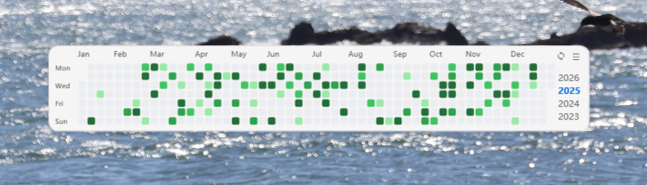
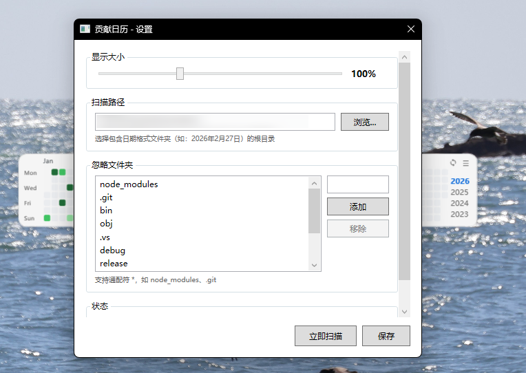
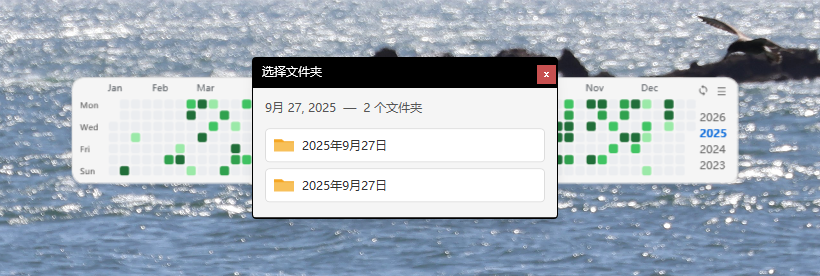
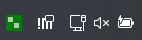

# 桌面贡献日历 (Desktop ContribCalendar)

一个轻量级的 Windows 桌面小部件，以 GitHub 风格的贡献日历可视化您的本地文件夹活动。



## ✨ 特性

- 🎨 **GitHub 风格日历** - 熟悉的绿色方块贡献图，按月分组显示
- 📁 **本地文件夹追踪** - 自动扫描指定目录下的日期格式文件夹（如 `2026年2月27日`）
- 🖱️ **快速访问** - 点击任意日期直接打开对应的文件夹
- 🎯 **系统托盘** - 最小化到系统托盘，不占用任务栏空间
- 🔍 **实时监控** - 自动检测文件夹变化并更新显示
- ⚙️ **灵活配置** - 自定义扫描路径、忽略规则、显示大小（50%-200%）
- 🪟 **柔和阴影圆角** - 现代化的界面设计，纯净灰底搭配柔和投影
- 🚫 **无边框体验** - 定制化的沉浸式无边框窗口

## 📸 截图

### 主界面


### 设置窗口


### 文件夹选择


### 系统托盘


## 🚀 快速开始

### 系统要求

- Windows 10/11
- .NET 8.0 Runtime

### 安装

1. 从 [Releases](../../releases) 下载最新版本
2. 解压到任意目录
3. 运行 `ContribCalendar.exe`

### 首次使用

1. 首次启动会自动打开设置窗口
2. 点击"浏览..."选择包含日期文件夹的根目录
3. 点击"立即扫描"开始扫描
4. 点击"保存"完成配置

## 📂 文件夹命名规则

程序会自动识别以下格式的文件夹：

- `2026年2月27日`
- `2026年2月27日_项目名称`
- `2025年1月5日_tools`

支持任意后缀，只要以 `年月日` 格式开头即可。

> [!TIP]
> **快速建档技巧**：搭配常见中文输入法，可以直接输入 `rq`（日期缩写），选择出来的 `2026年2月27日` 这个候选项来快速建立当天的文件夹，这是本工具最顺手的推荐归档工作流！

## ⚙️ 配置说明

### 显示大小
- 滑块调节：50% - 200%
- 实时预览，保存后立即生效

### 扫描路径
- 选择包含日期文件夹的根目录
- 支持递归扫描子目录

### 忽略文件夹
- 支持精确匹配：`node_modules`
- 支持通配符：`.*`、`temp*`
- 默认忽略常见开发目录（`.git`、`bin`、`obj` 等）

## 🎯 使用技巧

### 系统托盘操作
- **双击图标** - 显示/隐藏主窗口
- **右键菜单** - 刷新数据、打开设置、退出程序

### 日历交互
- **鼠标悬停** - 显示日期和贡献数量
- **点击格子** - 打开对应日期的文件夹
- **多个文件夹** - 弹出选择窗口，显示文件夹图标

### 颜色说明
程序会**递归统计（包含子目录）**在这个日期文件夹内有多少个实质性的**文件**（在忽略名单外的文件）。
根据累计的文件总数，格子会呈现不同的颜色深度：

- 🟦 **浅灰色** - 无贡献（0 个文件）
- 🟩 **浅绿色** - 1-2 个文件
- 🟩 **中绿色** - 3-5 个文件
- 🟩 **深绿色** - 6-9 个文件
- 🟩 **最深绿** - 10+ 个文件

## 🛠️ 技术栈

- **框架**: .NET 8.0 + WPF
- **数据库**: SQLite (Dapper)
- **系统托盘**: H.NotifyIcon.Wpf
- **UI 设计**: 柔和阴影圆角窗口 + 自定义控件

## 📊 数据存储

所有数据存储在本地 SQLite 数据库，实现**真正的便携绿色版**，数据文件会存放在程序运行目录：
```
(程序运行同级目录)\data.db
```

包含：
- 文件夹扫描记录（增量更新缓存）
- 用户设置（扫描路径、窗口缩放比例）
- 忽略规则列表

## 🔧 开发

### 构建项目

```bash
git clone https://github.com/yourusername/ContribCalendar.git
cd ContribCalendar
dotnet restore
dotnet build
```

### 运行

```bash
dotnet run --project ContribCalendar
```

### 项目结构

```
ContribCalendar/
├── Controls/           # 自定义控件
│   ├── ContributionGrid.xaml
│   └── LoadingOverlay.xaml
├── Converters/         # 值转换器
│   └── IntensityColorConverter.cs
├── Models/             # 数据模型
│   ├── AppSettings.cs
│   ├── ContribData.cs
│   └── FolderRecord.cs
├── Services/           # 业务逻辑
│   ├── DatabaseService.cs
│   ├── FileScannerService.cs
│   └── FileWatcherService.cs
├── Utils/              # 工具类
│   └── DirectoryNameParser.cs
├── ViewModels/         # 视图模型
│   └── MainViewModel.cs
├── Views/              # 窗口视图
│   ├── FolderPickerWindow.xaml
│   └── SettingsWindow.xaml
└── MainWindow.xaml     # 主窗口
```

## 🤝 贡献

欢迎提交 Issue 和 Pull Request！

### 贡献指南

1. Fork 本仓库
2. 创建特性分支 (`git checkout -b feature/AmazingFeature`)
3. 提交更改 (`git commit -m 'Add some AmazingFeature'`)
4. 推送到分支 (`git push origin feature/AmazingFeature`)
5. 开启 Pull Request

## 📝 更新日志

### v1.0.0 (2026-02-27)

- ✨ 初始版本发布
- 🎨 GitHub 风格贡献日历
- 📁 本地文件夹扫描与追踪
- 🖱️ 点击打开文件夹功能
- ⚙️ 完整的设置界面
- 🎯 系统托盘支持
- 🔍 实时文件监控

## 📄 许可证

本项目采用 MIT 许可证 - 详见 [LICENSE](LICENSE) 文件

## 🙏 致谢

- 灵感来源于 GitHub 的贡献日历
- 图标设计参考了 Windows 11 设计语言

## 📮 联系方式

- 提交 Issue: [GitHub Issues](../../issues)
- 邮箱: your.email@example.com

---

⭐ 如果这个项目对你有帮助，请给个 Star！
